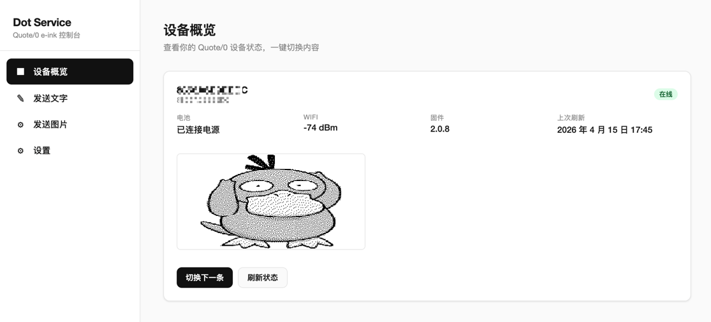

# Dot Service

Dot Service 是一个面向 **MindReset Dot. Quote/0** 墨水屏设备的自托管控制服务，提供浏览器界面和 REST API，用来查看设备状态、发送文字和上传图片。



## 功能

- Web 控制台：查看设备状态、发送文字/图片、管理配置
- REST API：基于 FastAPI，自动生成 Swagger 文档
- 文字发送：`POST /text`
- 文字转图片：`POST /text-to-image`，适合自定义字号和版式
- 图片发送：`POST /image` / `POST /image/upload`
- 上传图片时会自动缩放到 `296x152`

## 快速开始

### 1. 安装

```bash
git clone git@github.com:Ebispongebob/dot-service.git
cd dot-service
python -m venv .venv
source .venv/bin/activate  # Windows: .venv\Scripts\activate
pip install -r requirements.txt
cp .env.example .env
```

### 2. 配置

在 `.env` 中至少填写：

```ini
DOT_API_KEY=dot_app_xxxxxxxxxxxx
DOT_DEFAULT_DEVICE_ID=
DOT_API_BASE_URL=https://dot.mindreset.tech
SERVICE_HOST=0.0.0.0
SERVICE_PORT=8000
```

也可以在 `/ui/settings` 页面保存配置。页面保存的数据会写入仓库根目录的 `ui_settings.json`，不要提交到 Git。

### 3. 启动

```bash
python run.py
# 或
uvicorn app.main:app --host 0.0.0.0 --port 8000
```

启动后访问：

- 控制台：`http://localhost:8000/`
- API 文档：`http://localhost:8000/docs`

## 常用接口

- `GET /health`
- `GET /devices`
- `GET /devices/{device_id}/status`
- `POST /text`
- `POST /text-to-image`
- `POST /image`
- `POST /image/upload`

## 说明

- `python run.py` 是本地开发入口，默认启用热重载
- 设备 ID 优先级：请求参数 `device_id` > `ui_settings.json` > `.env` 中的 `DOT_DEFAULT_DEVICE_ID`
- `POST /text` 使用设备/云端的文字排版能力
- `POST /text-to-image` 会先在服务端把文字渲染成图片，再通过图片接口发送
- 修改 `.env` 后需要重启服务，运行中的进程不会自动重新读取配置

## 代码结构

- `app/main.py`：FastAPI 应用、UI 路由、API 路由
- `app/dot_client.py`：Dot Cloud API 封装
- `app/image_utils.py`：图片缩放、Base64 转换、文字渲染
- `run.py`：本地开发启动入口

## 贡献

欢迎提交 Issue 或 Pull Request。
